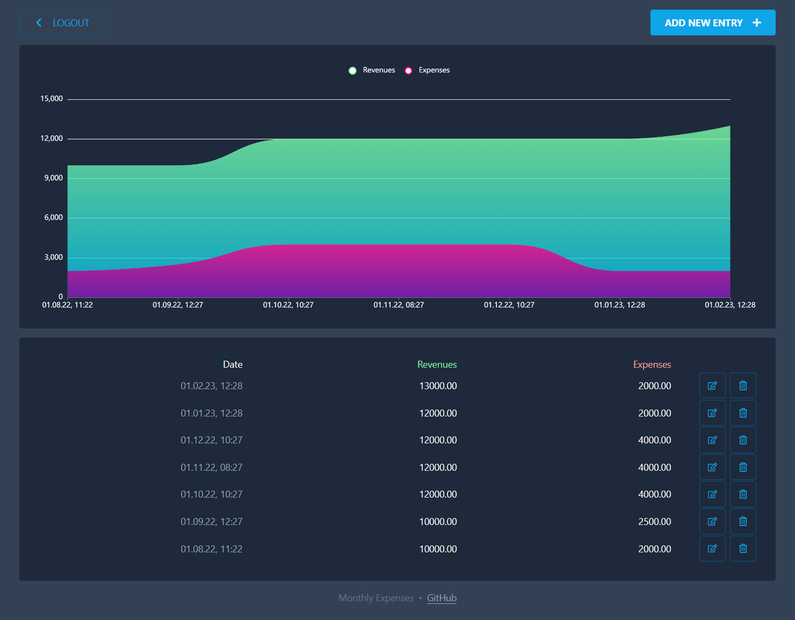

# Monthly Expenses

Simple web app to track and visualize monthly expenses

All data except for the username and dates will be encrypted with your encryption key in your browser before being sent to the server and stored in the database.

Demo: <https://monthly-expenses.vercel.app/>

## Technologies

The project was setup with the so called [T3 stack](https://create.t3.gg/)

- [Next.js](https://nextjs.org/)
- [TypeScript](https://www.typescriptlang.org/)
- [tRPC](https://trpc.io/)
- [Tailwind CSS](https://tailwindcss.com/)
- [Prisma](https://www.prisma.io/)
- [PlanetScale](https://planetscale.com/)
- [Vercel](https://vercel.com/)
- [NextAuth.js](https://next-auth.js.org/)
- [React Table](https://github.com/TanStack/table)
- [react-hot-toast](https://github.com/timolins/react-hot-toast)
- [React Icons](https://github.com/react-icons/react-icons)
- [Apache ECharts](https://echarts.apache.org/)

## Usage

### Requirements

- [nvm](https://github.com/nvm-sh/nvm)
- [PlanetScale CLI](https://planetscale.com/features/cli)

### Setup

1. Install required Node.js version: `nvm install`
2. Install npm packages: `cd app & npm ci`
3. Create database on PlanetScale: `pscale database create monthly-expenses`
4. Duplicate `.env.example` to `.env` and adjust it to your needs

### Running the app on you machine

1. `pscale connect monthly-expenses main`
2. `npx prisma db push`
3. `npm run dev`
4. Access app at <http://localhost:3000>

## License

See [LICENSE](./LICENSE)
